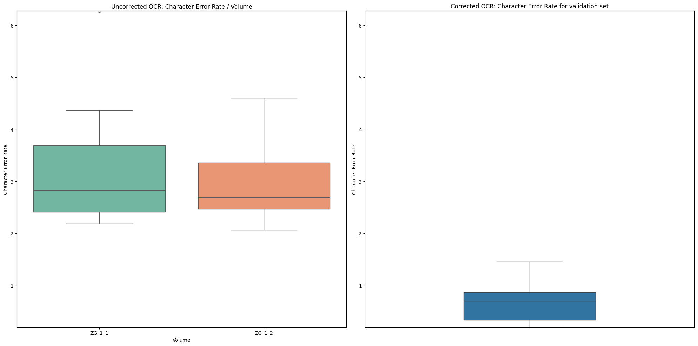

# SSRQ Retro Lab

This repository contains code (python scripts as well as jupyter notebooks) and data of retrodigitized volumes of the collection of Swiss Law Sources (SLS). The data is used for various experiments to evaluate the quality of the digitzation process, to improve the quality of the OCR results and to develop a workflow for the retrodigitization of the SLS collection. Furthermore, it shows possible ways for further usage of the data by using advanced methods like topic modeling or named entity recognition.

## Background

### Swiss Law Sources

The Swiss law Sources were established at the end of the 19th century by the Swiss Lawyers' Association with the aim of making sources of the legal history of Switzerland accessible to an interested public. The collection of legal sources is nowadays supported by a foundation established in 1980. Part of this foundation is the ongoing research project under the direction of Pascale Sutter. About 15 years ago, the Foundation decided to start digitising the collection of Swiss law sources. The result of this process is the online platform called ["SSRQ Online"](https://www.ssrq-sds-fds.ch/online/cantons.html), which makes all scanned books as PDFs available to the public. The PDFs have been further processed by OCR software, but no correction or any other post-processing (e.g. annotation of named entities) has been done so far. The PDFs are just the starting point for a long journey of further processing and analysis.

### Idea of the 'Retro Lab'

The idea of the 'Retro Lab' is to use the digitized volumes of the SLS collection as a testbed for various experiments. Different methods and tools are used to evaluate the quality of the digitization process, to improve the quality of the OCR results and to develop a workflow for the retrodigitization of the SLS collection. A special focus is on the usage of generative AI models like GPT-3.5/4 to create an advanced processing pipeline, where most of the hard work is done by the AI.

## Data and Code

### Data

The data is stored in the folder `data`. It contains the following subfolders:

- [export](./data/export): Contains a ground truth transcription of 53 pages from two volumes. This transcription was created in transkribus and exported as a txt file.
- [ZG](./data/ZG): Contains the OCR results of the volume "ZG" (Zug) as a PDF file. The OCR results were created by the OCR software Abbyy Finereader. Furthermore it contains training and validation data as txt- and json-files.

### Code

The code of the project is divided into two parts:

1. Utility code, organized in python modules (everything beneath `src`)
2. Analysis code, organized in jupyter notebooks (everything beneath `notebooks`)

All dependencies are listed in the [pyproject.toml](./pyproject.toml) file. The code is written for python >= 3.11. The management of virtual environments is done with [hatch](https://github.com/pypa/hatch). To create a new virtual environment, run `hatch env create` in the root directory of the project. To activate the environment, run `hatch env shell`. The environment will have all dependencies installed.

Note: You will need a valid API key for the OpenAI API to run the notebooks.

## Experiments

### OCR-Correction

The OCR results of the example volumes (ZG 1.1 and 1.2) are pretty good. Nevertheless, there are some errors. The goal of this experiment is to correct the OCR results with the help of GPT-3.5. First results are promising. While the initial CER of the training set was ~3% in average, the CER of the corrected text is 0.7%.

See the [validation set](./data/ZG/openai_ocr_validation.jsonl) for details on the setup of the experiment.

### Recognition of text sections per page

The goal of this experiment is to recognize the different text sections per page (a page may contain transcriptions of several documents). The idea is to use the corrected OCR results of the page as input for a 'classification model'. The model should then predict the text sections of the page – so don't need to rely on the layout of the page (e.g. position of text sections, captions, etc.).

*First results*: While the number of predicted text sections is 100% correct (F1 score = 1.0), the experiment should some problems with inaccurate prompts (e.g. "Headers can be ignored"), which lead to wrong positions of the marked text sections. This problem should be solved in the next iteration of the experiment.

### Classification of text sections (e.g. transcript, summary, etc.)

The next step is to classify the marked text sections and categorize them into three different classes:

1. Transcript – a 'real' transcript of a document
2. Summary – a summary of a document created by the editors of the volume
3. Fragment – a fragment of a document (either transcript or summary), which starts on the previous page

*First results*: While the GPT predicted the correct number of categories, the accuracy of the classification was not very good. See the [validation notebook](./notebooks/validate_finetuned_openai_model.ipynb) for details. Needs further investigation.

### Further annotation (e.g. named entities)

To be done.

### Conversion to TEI-XML

To be done.

## Authors

[Bastian Politycki](https://github.com/Bpolitycki) – University of St. Gallen / Swiss Law Sources

## References

- Ekin, Sabit. „Prompt Engineering For ChatGPT: A Quick Guide To Techniques, Tips, And Best Practices“. Preprint, 29. April 2023. [https://doi.org/10.36227/techrxiv.22683919.v1](https://doi.org/10.36227/techrxiv.22683919.v1).
- Liu, Yuliang, Zhang Li, Hongliang Li, Wenwen Yu, Yang Liu, Biao Yang, Mingxin Huang, u. a. „On the Hidden Mystery of OCR in Large Multimodal Models“. arXiv, 18. Juni 2023. [https://doi.org/10.48550/arXiv.2305.07895](https://doi.org/10.48550/arXiv.2305.07895).
- - Møller, Anders Giovanni, Jacob Aarup Dalsgaard, Arianna Pera, und Luca Maria Aiello. „Is a Prompt and a Few Samples All You Need? Using GPT-4 for Data Augmentation in Low-Resource Classification Tasks“. arXiv, 26. April 2023. [http://arxiv.org/abs/2304.13861](http://arxiv.org/abs/2304.13861).
- Pollin, C. (2023). Workshopreihe "Angewandte Generative KI in den (digitalen) Geisteswissenschaften" (v1.0.0). Zenodo. [https://doi.org/10.5281/zenodo.10065626](https://doi.org/10.5281/zenodo.10065626).
- Rockenberger, Annika. „Automated Text Recognition with ChatGPT 4“. Annika Rockenberger (blog), 19. Oktober 2023. [https://www.annikarockenberger.com/2023-10-19/automated-text-recognition-with-chatgpt-4/](https://www.annikarockenberger.com/2023-10-19/automated-text-recognition-with-chatgpt-4/).
