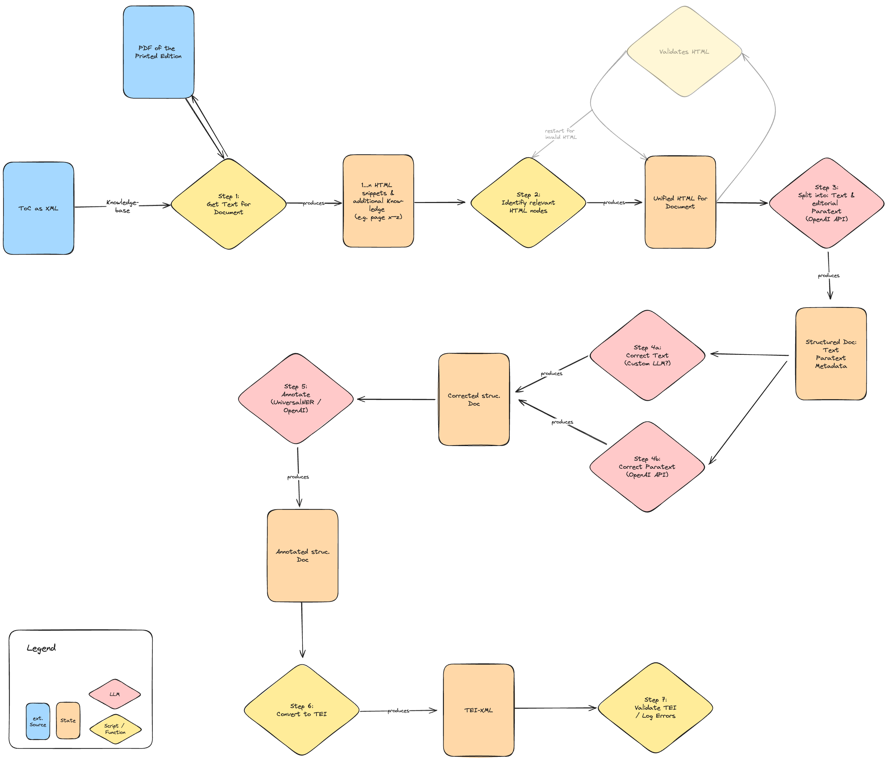
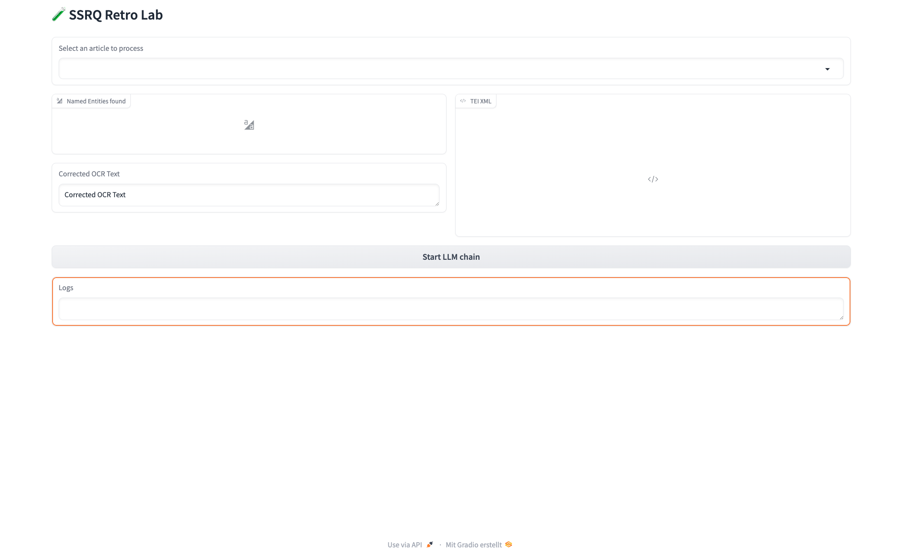

# SSRQ Retro Lab [](https://zenodo.org/doi/10.5281/zenodo.10683208)

This repository contains code (Python scripts as well as Jupyter notebooks) and data of retrodigitized units from the collection of Swiss Law Sources (SLS). The data is used for various experiments to evaluate the quality of the digitization process, improve the quality of OCR results, and develop a workflow for the retrodigitization of the SLS collection. Furthermore, it demonstrates potential ways for further use of the data by employing advanced methods such as topic modeling or named entity recognition.

## Table of Contents

- [SSRQ Retro Lab ](#ssrq-retro-lab-)
  - [Table of Contents](#table-of-contents)
  - [Background](#background)
    - [Swiss Law Sources](#swiss-law-sources)
    - [Idea of the 'Retro Lab'](#idea-of-the-retro-lab)
  - [Data and Code](#data-and-code)
    - [Data](#data)
    - [Code](#code)
  - [Experiments](#experiments)
    - [v1 of the experiment](#v1-of-the-experiment)
    - [v2 of the experiments](#v2-of-the-experiments)
      - [Pipeline Components](#pipeline-components)
        - [Text Extraction Component](#text-extraction-component)
        - [HTML Wrangler Component](#html-wrangler-component)
        - [Text Classifier Component](#text-classifier-component)
        - [OCR Correction Component](#ocr-correction-component)
        - [NER Annotation Component](#ner-annotation-component)
        - [TEI Conversion Component](#tei-conversion-component)
      - [Demo](#demo)
      - [To-Dos](#to-dos)
  - [Talks](#talks)
  - [Authors](#authors)
  - [References](#references)
  - [Tools used](#tools-used)


## Background

### Swiss Law Sources

The Swiss law Sources were established at the end of the 19th century by the Swiss Lawyers' Association with the aim of making sources of the legal history of Switzerland accessible to an interested public. The collection of legal sources is nowadays supported by a foundation established in 1980. Part of this foundation is the ongoing research project under the direction of Pascale Sutter. About 15 years ago, the Foundation decided to start digitizing the collection of Swiss law sources. The result of this process is the online platform called ["SSRQ Online"](https://www.ssrq-sds-fds.ch/online/cantons.html), which makes all scanned books as PDFs available to the public. The PDFs have been further processed by OCR software, but no correction or any other post-processing (e.g. annotation of named entities) has been done so far. The PDFs are just the starting point for a long journey of further processing and analysis.

### Idea of the 'Retro Lab'

The idea of the 'Retro Lab' is to use the digitized volumes of the SLS collection as a test bed for various experiments. Different methods and tools are used to evaluate the quality of the digitization process, to improve the quality of the OCR results and to develop a workflow for the retrodigitization of the SLS collection. A special focus is on the usage of **generative AI** models like GPT-3.5/4 to create an advanced processing pipeline, where most of the hard work is done by the AI.

## Data and Code

### Data

The data is stored in the folder `data`. It contains the following subfolders:

- [export](./data/export): Contains a ground truth transcription of 53 pages from two volumes. This transcription was created in transkribus and exported as a txt file.
- [ZG](./data/ZG): Contains the OCR results of the volume "ZG" (Zug) as a PDF file. The OCR results were created by the OCR software ABBYY Finereader. Furthermore, it contains training and validation data as `txt`- and `json`-files.

### Code

The code of the project is divided into two parts:

1. Utility code, organized in python modules (everything beneath `src`)
2. Analysis code, organized in Jupyter notebooks (everything beneath `notebooks`)

All dependencies are listed in the [`pyproject.toml`](./pyproject.toml) file. The code is written for python >= 3.11. The management of virtual environments is done with [hatch](https://github.com/pypa/hatch). To create a new virtual environment, run `hatch env create` in the root directory of the project. To activate the environment, run `hatch env shell`. The environment will have all dependencies installed.

Note: You will need a valid API key for the OpenAI API to run the notebooks.

## Experiments

### v1 of the experiment

For the first iteration of the experiments take a look at the [`v1`-branch](https://github.com/SSRQ-SDS-FDS/ssrq-retro-lab/tree/v1-ocr-and-classification).

### v2 of the experiments

The second iteration of the experiments tries to use a slightly different approach. Instead of just relying on the extracted plain text and trying to use a Large Language Model for further processing (like recognition of different documents) a mixed approach is used, which combines 'classical' methods with the usage of a Large Language Model. Therefore, a [pipeline](./src/ssrq_retro_lab/pipeline/chain.py) is created, which uses a combination of Python scripts and calls a LLM just for the parts, where it is really needed. The pipeline is shown in the following figure:



Each component is validated by a simple set of tests, which are located in the [tests](./tests) folder.

*No Langchain – why?* – [Langchain](https://www.langchain.com/) is a powerful, but also complex, framework. Most of it's features are not needed for the experiments. Instead a custom pipeline (chain) is created, which is tailored to the needs of the experiments.

#### Pipeline Components

##### [Text Extraction Component](./src/ssrq_retro_lab/pipeline/components/text_extractor.py)

The text extraction component is responsible for extracting the plain text (as HTML string) from the PDF(s). The document / article number is used as an input parameter. Beside the PDF it uses the XML Table of Content, which is the base for ["SSRQ Online"](https://www.ssrq-sds-fds.ch/online/cantons.html). It returns an object with the following structure:

```python
class TextExtractionResult(TypedDict):
    entry: VolumeEntry
    pages: tuple[str, ...]
```

The [`VolumeEntry`](./src/ssrq_retro_lab/pipeline/parser/xml_toc_parser.py) is a simple data class, which contains the metadata of the volume. The `pages` attribute is a tuple of strings, where each string represents the extracted text of a page as HTML string. The extraction and HTML conversion is handled by [PyMuPDF](https://pymupdf.readthedocs.io/en/latest/index.html).

##### [HTML Wrangler Component](./src/ssrq_retro_lab/pipeline/components/html_wrangler.py)

This component takes the extracted HTML string(s) and tries to extract the relevant HTML elements for the requested article. Like the first component it does not use a LLM.

*Shortcoming of this component*:

- Relies on the correct structure of the HTML string
- Relies on the OCR results of the PDF
- Quick & dirty implementation to find the relevant HTML elements

Returns the following object:

```python
class HTMLTextExtractionResult(TextExtractionResult):
    article: tuple[Selector, ...]
```

##### [Text Classifier Component](./src/ssrq_retro_lab/pipeline/components/text_classifier.py)

This component uses the nodes, extracted in the previous step, and tries to classify each of them. Uses the default GPT-4 model from OpenAI. The classification is done by using a prompt with Few-Shot examples:

- [Classification examples](./data/ZG/examples/few-shot-article-lines.json)
- [Prompt template](./src/ssrq_retro_lab/pipeline/templates/textline_classification_v1.jinja2)

Returns the following object:

```python
class StructuredArticle(BaseModel):
    article_number: int
    date: str
    references: list[str]
    summary: list[str]
    text: list[str]
    title: str
```

The component is tested against a few examples. The accuracy of this test cases is above 90%. See the [test cases](./tests/pipeline/components/test_text_classifier.py) for more details.

##### [OCR Correction Component](./src/ssrq_retro_lab/pipeline/components/ocr_corrector.py)

This component uses the structured article created in the previous step and tries to correct the OCR results. It uses a fine-tuned GPT-3.5 model for this task. The data used for fine-tuning can be found in the [data section](./data/ZG/training_data/gpt_ocr/). Some validation is done in a [Jupyter notebook](./notebooks/validate_ocr_gpt_3_v2.ipynb).

It returns the following object:

```python
class StructuredCorrectedArticle(StructuredArticle):
    corrected_references: CorrectedOCRText
    corrected_summary: CorrectedOCRText
    corrected_text: CorrectedOCRText
```

*Things left open*:

- [ ] Correct summary and references
- [ ] Implement better validation for the OCR correction

##### [NER Annotation Component](./src/ssrq_retro_lab/pipeline/components/ner_annotator.py)

As the last processing step some Named Entity Recognition (NER) is done. The NER is backed by [spacy-llm](https://spacy.io/usage/large-language-models), which uses a GPT-4 model and parses the output into a structured spacy document. Some simple validation is done [here](./tests/pipeline/components/test_ner_annotator.py).

It returns a tuple, which contains the `StructuredCorrectedArticle` and the `spacy.Doc`.

##### [TEI Conversion Component](./src/ssrq_retro_lab/pipeline/components/tei_converter.py)

Last but not least the result is converted into a TEI XML file. The TEI XML file is created by using a simple template, which is filled with the data of the `StructuredCorrectedArticle` and the `spacy.Doc`. The template can be found [here](./src/ssrq_retro_lab/pipeline/templates/tei_v1.jinja2).

#### Demo

The following video shows a demo of the complete process in a simple UI built with [`gradio`](https://www.gradio.app/). To speed up the process an article is used, which was already processed. The results for this article are retrieved from the cache. The cache is implemented with [`diskcache`](https://pypi.org/project/diskcache/)-library.

[](./static/pipeline-demo.mov)

#### To-Dos

This experiment is a first prototype, it is not ready for production use and there are some things left open:

- [ ] Implement better validation for all components
- [ ] Implement a 'Human in the Loop' for all steps in the pipeline
- [ ] Improve performance by bundling requests and / or using concurrent requests to external service (like OpenAI API)
- [ ] Implement checks for the prompts send to the LLM (e.g. check for the length of the prompt)
- ...

## Talks

The work done here will be presented in the context of the following talks:

- Bastian Politycki, Pascale Sutter, Christian Sonder: „Datenschätze heben. Ein Bericht zur Digitalisierung der Sammlung Schweizerischer Rechtsquellen“. Editions als Transformation. Plenartagung der AG für germanistische Edition, 21.–24. Februar 2024, Bergische Universität Wuppertal. *Slides will be linked here after the talk.*
- Bastian Politycki: „Anwendung generativer KI zur Digitalisierung gedruckter Editionen am Beispiel der Sammlung Schweizerischer Rechtsquellen“. W8: Generative KI, LLMs und GPT bei digitalen Editionen, DHd2024 Passau, 26.02.2024—01.03.2024. *Slides will be linked here after the talk.*

## Authors

[Bastian Politycki](https://github.com/Bpolitycki) – University of St. Gallen / Swiss Law Sources

## References

- Ekin, Sabit. „Prompt Engineering For ChatGPT: A Quick Guide To Techniques, Tips, And Best Practices“. Preprint, 29. April 2023. [https://doi.org/10.36227/techrxiv.22683919.v1](https://doi.org/10.36227/techrxiv.22683919.v1).
- González-Gallardo, Carlos-Emiliano, Emanuela Boros, Nancy Girdhar, Ahmed Hamdi, Jose G. Moreno, und Antoine Doucet. „Yes but.. Can ChatGPT Identify Entities in Historical Documents?“ arXiv, 30. März 2023. [https://doi.org/10.48550/arXiv.2303.17322](https://doi.org/10.48550/arXiv.2303.17322).
- Liu, Yuliang, Zhang Li, Hongliang Li, Wenwen Yu, Yang Liu, Biao Yang, Mingxin Huang, u. a. „On the Hidden Mystery of OCR in Large Multimodal Models“. arXiv, 18. Juni 2023. [https://doi.org/10.48550/arXiv.2305.07895](https://doi.org/10.48550/arXiv.2305.07895).
- - Møller, Anders Giovanni, Jacob Aarup Dalsgaard, Arianna Pera, und Luca Maria Aiello. „Is a Prompt and a Few Samples All You Need? Using GPT-4 for Data Augmentation in Low-Resource Classification Tasks“. arXiv, 26. April 2023. [http://arxiv.org/abs/2304.13861](http://arxiv.org/abs/2304.13861).
- Pollin, C. (2023). Workshopreihe "Angewandte Generative KI in den (digitalen) Geisteswissenschaften" (v1.0.0). Zenodo. [https://doi.org/10.5281/zenodo.10065626](https://doi.org/10.5281/zenodo.10065626).
- Rockenberger, Annika. „Automated Text Recognition with ChatGPT 4“. Annika Rockenberger (blog), 19. Oktober 2023. [https://www.annikarockenberger.com/2023-10-19/automated-text-recognition-with-chatgpt-4/](https://www.annikarockenberger.com/2023-10-19/automated-text-recognition-with-chatgpt-4/).
- Zhou, Wenxuan, Sheng Zhang, Yu Gu, Muhao Chen, und Hoifung Poon. „UniversalNER: Targeted Distillation from Large Language Models for Open Named Entity Recognition“, 2023. [https://doi.org/10.48550/ARXIV.2308.03279](https://doi.org/10.48550/ARXIV.2308.03279).

## Tools used

- [Jinja2](https://jinja.palletsprojects.com/en/3.1.x/) - for creating programmable prompt templates
- [OpenAI Python SDK](https://github.com/openai/openai-python)
- [parsel](https://parsel.readthedocs.io/en/latest/)
- [pytest](https://docs.pytest.org/en/8.0.x/)
- [spacy](https://spacy.io/)

For a complete list see [pyproject.toml](./pyproject.toml).
